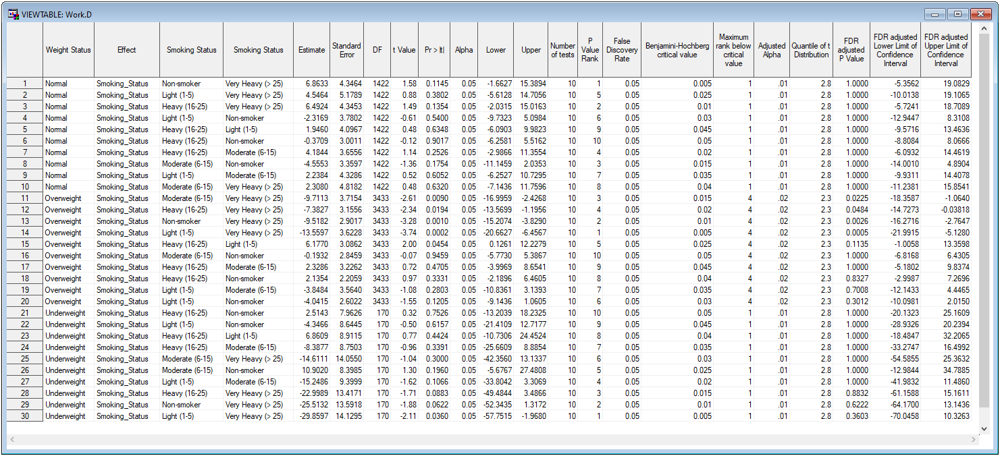

# BH-CIs
Benjamini-Hochberg adjusted confidence intervals

### Multiple testing

Multiple testing problem can be addressed by adjusting the p-values from a set of hypothesis tests. There are various different methods and procedures to define the smallest significance level for which the given hypothesis would be rejected taking into account the entire set of tests. This can be done, for example, in SAS by using `PROC MULTTEST` procedure, but the adjustment is applied only to the p-values, but often there is an urge to adjust the corresponding confidence intervals also.

### Benjamini-Hochberg procedure

Procedure to control false discovery rate was proposed by Benjamini and Hochberg and is often used instead of Bonferroni correction which is widely considered to be too conservative correction, especially in cases of very large set of tests.

The basic principles of B-H procedure is to select a desired false discovery rate known as `Q` value in the procedure. The p-values from a set of tests are ranked from the smallest p-value to the largest p-value. Then, a critical value is derived from the rank (`rank`), total number of tests (`m`) and the chosen false discovery rate (`Q`). After that, the largest p-value that is below this critical value is identified (`R`) and every p-value less than that are considered statistically significant after the B-H correction and every p-value which is greater than that are considered statistically insignficant.

#### Derivations

* Alpha level for calculating adjusted confidence intervals is adjusted using these readily defined variables
* Quantile from the Student's t distribution is defined using adjusted Alpha
* p-value is the probability from the Student's t distribution scaled by adjusted Alpha
* Confidence interval is calculated from estimate and its standard error by "penalizing" with derived t distribution quantile

### Example

An example program can be run as-is - it utilizes `SASHELP` data.

